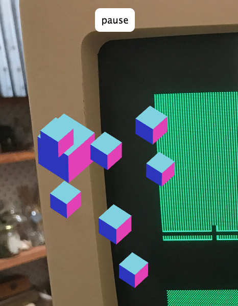

# ❑



Demostración de **Three.js** con **React.js** y **Tone.js** usando **react-three-renderer**.

#### Demo
[https://pesinasiller.github.io/hexaedros](https://pesinasiller.github.io/hexaedros) 

#### Instrucciones
Para desarrollo:
```sh
$ npm start
```

para compilar:
```sh
$ npm run build
```
para publicar en GitHub-Pages:
```sh
$ npm run deploy
```
[https://codeburst.io/deploy-react-to-github-pages-to-create-an-amazing-website-42d8b09cd4d](https://codeburst.io/deploy-react-to-github-pages-to-create-an-amazing-website-42d8b09cd4d) 


